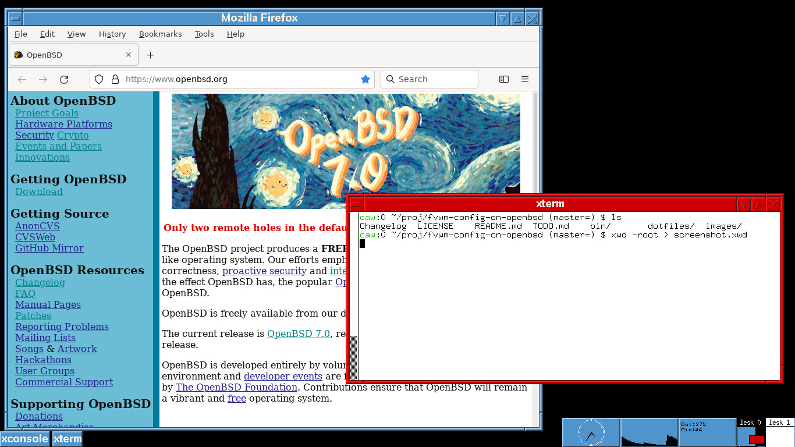

# FVWM config on OpenBSD

## Intro

This is an attempt at a nice desktop environment using stock OpenBSD apps.

After finally getting a laptop that OpenBSD supports, I wanted a good desktop without installing a large window manager and dozens of its prerequisite packages. Plus I prefer the simplicity and correctness of what this OS provides. There's no reason to go elsewhere.

## Features

* Clean, low-clutter desktop.

* Information displays in the lower right corner (xclock, xload, battery status, and the FVWM pager).

* Icons for minimised windows in the lower left corner.

* Mouse menus in root window:

  * Left button: Commands, log out, volume, lock screen, reboot, etc.

  * Middle button: Window Operations.

  * Right button: Window List.

* Works without installing extra software packages or ports.

* The .xsession file adds these features:

  * Remaps the Caps Lock key to be another Control key.

  * Starts the xidle command, which locks the screen after 10 minutes of inactivity.

### Battery Status

A new battery status indicator was added on 2020-07-06. The indicator shows percentage remaining and minutes remaining, as reported by the apm command. If the battery is not present, it shows 'unknown'.

Feedback on this new feature is appreciated. It's been tested on my two laptops with different screen resolutions.

## Requirements

OpenBSD 6.9 and its bundled FVWM. This was developed on OpenBSD/amd64 6.9 (and 6.0 - 6.8) and FVWM version 2.2.5. Other versions may work as well.

No additional software beyond the base installation is required.

## Install

### Window Manager

Run:

~~~
./bin/install.sh
~~~

Or manually:

Copy the "dot" files in your home directory, and remove the "dot" from the filename. Note that the .xsession file needs the execute mode set. Like this:

~~~
install         dotfiles/dot.fvwmrc    ~/.fvwmrc
install         dotfiles/dot.Xdefaults ~/.Xdefaults
install -m 0755 dotfiles/dot.xsession  ~/.xsession
~~~

### Reboot and Shutdown (Optional)

For the shutdown and reboot commands to work, your account needs password-less root privileges using doas. Something like this in the /etc/doas.conf file should work (assuming your account is in the wheel group):

~~~
permit nopass :wheel as root cmd /sbin/reboot
permit nopass :wheel as root cmd /sbin/shutdown args -hp now
~~~

Since the last matching rule takes precedence, put these at the bottom of the file.

### Lock Screen on Suspend (Optional)

The .xsession file starts xidle, which locks the screen after 10 minutes of inactivity. It's a good idea to lock the screen when suspending your laptop as well. Put the following into /etc/apm/suspend (and make it executable):

~~~
#!/bin/sh
pkill -USR1 xidle
~~~

## Thanks

Thanks to the many people who provided docs and example configurations.

Feedback and ideas are always welcome.
